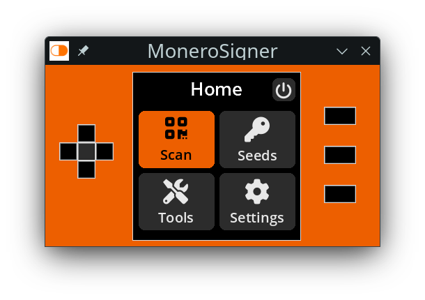

# MoneroSigner Emulator (fork of [SeedSigner Emulator](https://github.com/enteropositivo/seedsigner-emulator)
> Allows to execute [MoneroSigner](https://github.com/DiosDelRayo/MoneroSigner) air-gapped hardware wallet in your desktop (windows/linux/mac)




## Todo
See the separate [Todo list](Todo.md)

## How it works
A new display driver that replaces the existing _SeedSigner ST7789 1.3_ driver, making possible to execute the device in a desktop enviroment.

>Use it with the integrated buttons or with your keyboard ( Arrow Keys, Enter, 1,2,3 )

The Emulator should still work with [SeedSigner](https://github.com/SeedSigner/seedsigner), but is only tested with [MoneroSigner](https://github.com/DiosDelRayo/MoneroSigner).

To run the **MoneroSigner Emulator** on Linux you need to clone [MoneroSigner](https://github.com/DiosDelRayo/MoneroSigner) and [MoneroSigner Emulator](https://github.com/DiosDelRayo/monerosigner-emulator) in the same folder, then create a virtual environment with `python3 -m venv .`, `make install`, `make load` and `make run` and you are running on Linux the the emulator. On Windows or MacOS I'm not yet aware if there is a an overlay file system (`mount -t overlay`) which is used to run the emulator without to touch anything on any repository.

If you have more then one camera on the system there will appear a dropdown list on the upper left corner to select the camera which will be used next time.

Planed features:
- [x] Build executable for linux on linux
- [ ] Build executable for win32 on Windows (maybe cross compiling or using vagrant to build)
- [ ] Build AppImage for MacOS on MacOS (maybe using vagrant to build, still fighting with a newer version of MacOS in lvm/libvirt/qemu)

## Quickstart (Linux, win32, MacOS coming soon)

### Linux
Do following in your console:
```
mkdir -p monerosigner
cd monerosigner
git clone https://github.com/DiosDelRayo/MoneroSigner.git
git clone https://github.com/DiosDelRayo/monerosigner-emulator
cd monerosigner-emulator
python3 -m venv .
source bin/activate
make install
make load
make run
make unload
deactivate
```

For all future uses you can use it simply with:
```
cd monerosigner-emulator
source bin/activate
make load && make run; make unload
```

### Windows
Execute the following command in the Cmd to install all dependencies and clone the necessary archives:
```
powershell -Command "Invoke-Expression ((New-Object System.Net.WebClient).DownloadString('https://raw.githubusercontent.com/DiosDelRayo/monerosigner-emulator/master/quickstart.bat')) 'bootstrap'"
```

Terminal (Powershell)
```
powershell -ExecutionPolicy Bypass -Command "Invoke-Expression ((New-Object System.Net.WebClient).DownloadString('https://raw.githubusercontent.com/DiosDelRayo/monerosigner-emulator/master/quickstart.ps1')); & quickstart.ps1 -action bootstrap"
```

Later from the repository:
```
powershell -ExecutionPolicy Bypass -File quickstart.ps1 -action executable
```

**WARNING: __Do not use restart shutdown o restart in the MoneroSigner at the moment how it will shutdown/reboot your machine. Will search for a possibility to intercept it. Close for the moment simply the emulator window (X)__** [#Todo](Todo.md)

Now you should see the emulator.

## Executables, as soon I have a build chain I will frequently release them in Releases

## Thank you

 Thank you for your work [@EnteroPositivo](https://twitter.com/enteropositivo)on X.
